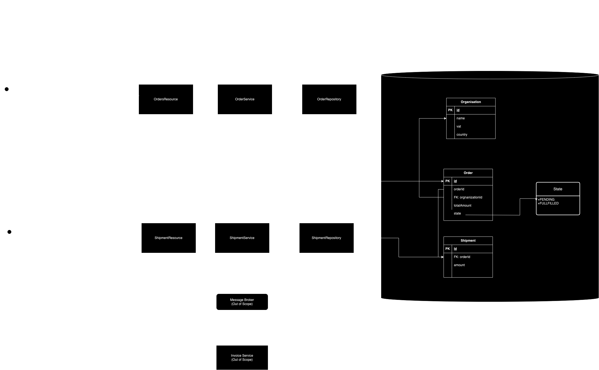

# Notes

### 1. Design
Please find attach a diagram with a overall idea of what was implemented in my solution.



### 2. Considerations

* Since the exercise mention the ability of invoice both buyer and seller but was not requires in the scope of this
  solution (as far as I understood), I in any case outline in the diagram what could be my vision of a subsequent
  feature like that


* I also deliberately left out of the scope functionalities such as:
    * Get All Orders for an Organisation
    * Get All Shipments for an Order


* I took the liberty to change the package structure to follows some of the guidelines of Hexagonal Architecture (Ports and Adapters). Reason for that is that I believe of the benefits of such architecture aiming for good code.
  * I understand
    there some things that can be improved and moved around but that's something that it's always open for discussions for alignments and agreements but nevertheless wanted to share my view on it.


### 3. Sample Requests

#### 3.1 Create Order
```http request
POST http://localhost:8080/orders
{
    "organisation_id": "0c19408f-ad8e-4115-a5f1-1526e1071642",
    "order_amount": 100.00,
    "order_date": "20/11/2023"
}
```

#### 3.2 Create Shipment
```http request
POST http://localhost:8080/shipments
{
    "order_id": "6984a3cc-cb34-4306-af61-9d57f74afb73",
    "amount": 30.00,
    "shipment_date": "17/11/2023"
}
```
